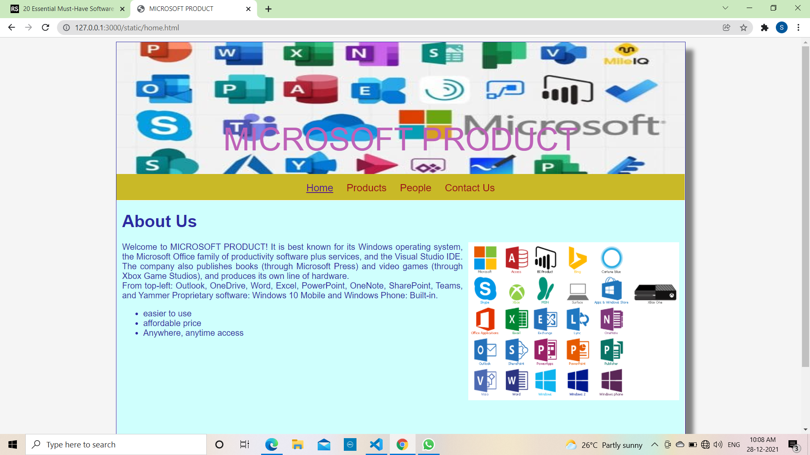
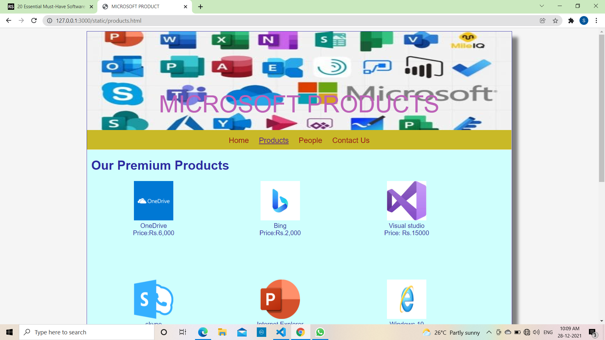
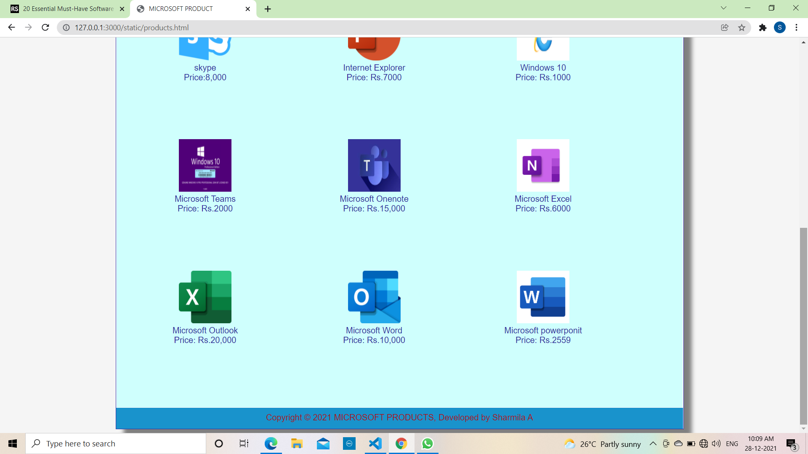
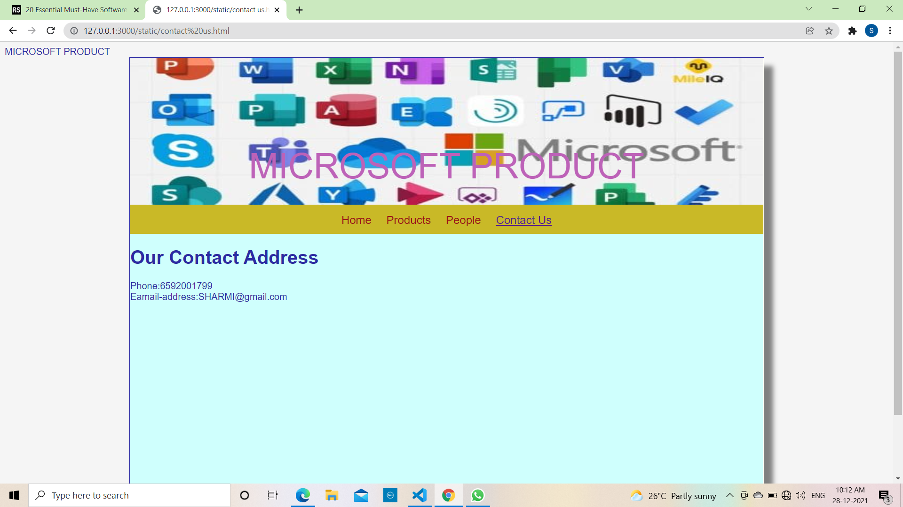
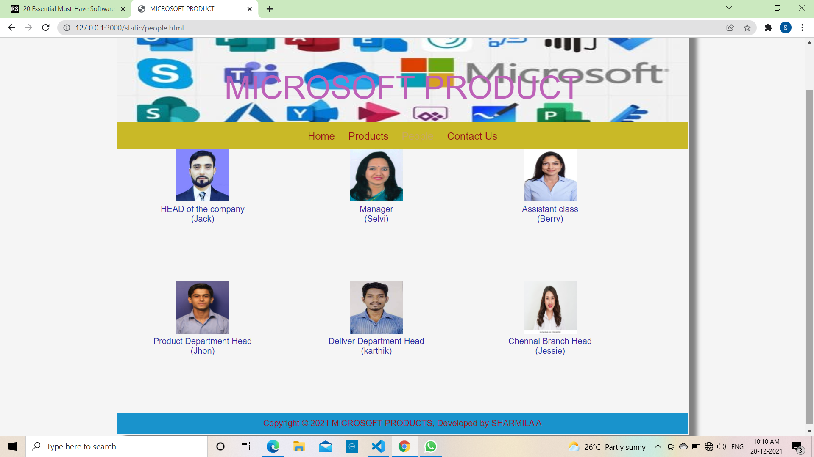

# Web Design for a Software Product Company

## AIM:

To design a static website for a software product company company.

## DESIGN STEPS:

### Step 1:

Requirement collection.

### Step 2:

Creating the layout using HTML and CSS.

### Step 3:

Updating the sample content.

### Step 4:

Choose the appropriate style and color scheme.

### Step 5:

Validate the layout in various browsers.

### Step 6:

Validate the HTML code.

### Step 6:

Publish the website in the given URL.

## PROGRAM :
HOME.html
<!DOCTYPE html>
<html lang="en">
  <head>
    <title>MICROSOFT PRODUCT</title>
    <link rel="stylesheet" href="./css/layout.css" />
    <link rel="icon" href="./img/IC1.jpg" type="image/x-icon" />
  </head>

  <body>
    

      
MICROSOFT PRODUCT

      

        
<a href="/static/home.html">Home</a>

        
<a href="/static/products.html">Products</a>

        
<a href="/static/people.html">People</a>

        
<a href="/static/contact us.html">Contact Us</a>

      

      

        

          <h1>About Us</h1>
          
          

            Welcome to MICROSOFT PRODUCT!
            It is best known for its Windows operating system, the Microsoft Office family of productivity software plus services,
             and the Visual Studio IDE. The company also publishes books (through Microsoft Press) and video games
              (through Xbox Game Studios), and produces its own line of hardware.
             
          
              From top-left: Outlook, OneDrive, Word, Excel, PowerPoint, OneNote, SharePoint, Teams, and Yammer 
               Proprietary software: Windows 10 Mobile and Windows Phone: Built-in.
            <ul>
              <li> easier to use</li>
              <li>affordable price</li>
              <li>Anywhere, anytime access</li>
            </ul>
          

        

      

      

        Copyright &#169; 2021 MICROSOFT PRODUCT, Developed by Sharmila
      

    

  </body>
</html>
PRODUCT.html
!DOCTYPE html>
<html lang="en">
  <head>
    <title>MICROSOFT PRODUCT</title>
    <link rel="stylesheet" href="./css/layout.css" />
    <link rel="icon" href="./img/ICON.jpg" type="image/x-icon" />
  </head>

  <body>
    

      
MICROSOFT PRODUCTS

      

        
<a href="/static/home.html">Home</a>

        
<a href="/static/products.html">Products</a>
  
        
<a href="/static/people.html">People</a>

        
<a href="/static/contact us.html">Contact Us</a>

      

      

        
    
          <h1>Our Premium Products</h1>
          

              
 
                  

                  
                  

                  
Google search engine

                  
Price:Rs.6,000

              

              
 
                  

                  
                  

                  
Google Chrome

                  
Price:Rs.2,000

              

              
 
                  

                  
                  

                  
Gmail

                  
Price: Rs.15000 

              

              
 
                

                
                

                
Android

                
Price:8,000 

            

            
 
              

              
              

              
Google Absense

              
Price: Rs.7000

          

          
 
            

            
            

            
Google drive

            
Price: Rs.1000

        

        
 
          

          
          

          
Google Ads

          
Price: Rs.2000

      

      
 
        

        
        

        
Google maps

        
Price: Rs.15,000 

    

    
 
      

      
      

      
Google docs

      
Price: Rs.6000 

    

    
 
       

       
       

       
Youtube

       
Price: Rs.20,000 

    

    
 
      

      
    

       
Google assistant

       
Price: Rs.10,000

    

    
 
      

      
     

        
Google EXpress 

        
Price: Rs.2559 

      

    

  
        
  

    

      Copyright &#169; 2021 MICROSOFT PRODUCT, Developed by SHARMILA
    

  

 </body>
</html>
PEPOPLE.html
<!DOCTYPE html>
<html lang="en">
  <head>
    <title>MICROSOFT PRODUCT</title>
    <link rel="stylesheet" href="./css/layout.css" />
    <link rel="icon" href=".img/icon.png" type="image/x-icon" />
  </head>

  <body>
    

      
MICROSOFT PRODUCT

      

        
<a href="/static/home.html">Home</a>

        
<a href="/static/products.html">Products</a>
  
        
People</a>

        
<a href="/static/contact us.html">Contact Us</a>

      

      
 
        

        
      

         
HEAD of the company
            
           (Jack)
         

      

      
 
        

        
      

         
Manager
            
           (Selvi)
         

      

      
 
        

        
      

         
Assistant class  (Berry)

      

      
 
        

        
      

         
Product Department Head   (Jhon)

      

      
 
        

        
      

         
Deliver Department Head   (karthik)

      

      
 
        

        
      

         
Chennai Branch Head   (Jessie)

      

      

        Copyright &#169; 2021 MICROSOFT, Developed by SHARMILA
      

    

  </body>
</html>

## OUTPUT:

### Home Page:

## Result:

Thus a website is designed for the software product company and the HTML,CSS code are validated.
LAYOUT.css
 {
  box-sizing: border-box;
  font-family: Arial, Helvetica, sans-serif;
}
body {
  background-color: whitesmoke;
  color: #2c2aa3;
}
.container {
  width: 1080px;
  margin-left: auto;
  margin-right: auto;
  border-width: 1px 1px 1px 1px;
  border-style: solid;
  box-shadow: 15px 15px 8px gray;
}

.banner {
  display: block;
  width: 100%;
  height: 250px;
  text-align: center;
  font-size: 60px;
  background-image: url("/static/img/BA1.jpg");
  background-size: 100% 100%;
  margin: 0px 0px 0px 0px;
  padding-top: 150px;
  color: #bd62b8;
}

.menu {
  display: block;
  width: 100%;
  height: 50px;
  font-size: larger;
  background-color: #c9b927;
  text-align: center;
  padding-top: 15px;
  margin: 0px 0px 0px 0px;
  border-width: 1px;
}

.menuitem {
  display: inline-block;
  margin-left: 10px;
  margin-right: 10px;
}
.menuitemselected {
  display: inline-block;
  margin-left: 10px;
  margin-right: 10px;
  color: #caaa63;
}

.menuitem a {
  text-decoration: none;
  color: #9c1018;
}

.content {
  display: block;
  width: 100%;
  background-color: #cffffd;
  min-height: 500px;
  margin: 0px 0px 0px 0px;
  border-width: 1px;
  border-color: white;
  border-style: solid;
}
.homecontent {
  min-height: 500px;
  margin: 10px 10px 10px 10px;
}
.homecontent h1 {
  text-align: left;
}
.homecontent img {
  float: right;
  width: 400px;
  height: 300px;
  margin-left: 10px;
}

.contenttext {
  text-align: justify;
}

.productcontent {
  min-height: 500px;
  margin: 10px 10px 10px 10px;
}

.productcontent h1 {
  text-align: left;
}

.productitems {
  display: block;
}

.productitem {
  display: inline-block;
  width: 30%;
  height: 250px;
  text-align: center;
}

.productitem img {
  width: 100px;
  height: 100px;
  display: block;
}
.productitem .itemimage {
  display: block;
  margin-left: auto;
  margin-right: auto;
  width: 100px;
  margin-bottom: 5px;
}

.productitem .itemname {
  display: block;
}
.productitem .itemprice {
  display: block;
}

.footer {
  display: block;
  width: 100%;
  height: 40px;
  background-color: #1993cc;
  text-align: center;
  padding-top: 10px;
  margin: 0px 0px 0px 0px;
  color: #9c1018;
}
layout.css:

* {
  box-sizing: border-box;
  font-family: Arial, Helvetica, sans-serif;
}
body {
  background-color: whitesmoke;
  color: #17421d;
}
.container {
  width: 1080px;
  margin-left: auto;
  margin-right: auto;
  border-width: 1px 1px 1px 1px;
  border-style: solid;
  box-shadow: 15px 15px 8px gray;
}

.banner {
  display: block;
  width: 100%;
  height: 250px;
  text-align: center;
  font-size: 60px;
  background-image: url("/static/img/BAC.jpg");
  background-size: 100% 100%;
  margin: 0px 0px 0px 0px;
  padding-top: 150px;
  color: black;
}

.menu {
  display: block;
  width: 100%;
  height: 50px;
  font-size: larger;
  background-color:black;
  text-align: center;
  padding-top: 15px;
  margin: 0px 0px 0px 0px;
  border-width: 1px;
}

.menuitem {
  display: inline-block;
  margin-left: 10px;
  margin-right: 10px;
}
.menuitemselected {
  display: inline-block;
  margin-left: 10px;
  margin-right: 10px;
  color:rgb(114, 14, 114);
}

.menuitem a {
  text-decoration: none;
  color: #9c1018;
}

.content {
  display: block;
  width: 100%;
  background-color:white;
  min-height: 500px;
  margin: 0px 0px 0px 0px;
  border-width: 1px;
  border-color: white;
  border-style: solid;
}
.homecontent {
  min-height: 500px;
  margin: 10px 10px 10px 10px;
}
.homecontent h1 {
  text-align: left;
}
.homecontent img {
  float: right;
  width: 400px;
  height: 300px;
  margin-left: 10px;
}

.contenttext {
  text-align: justify;
}

.productcontent {
  min-height: 500px;
  margin: 10px 10px 10px 10px;
}

.productcontent h1 {
  text-align: left;
}

.productitems {
  display: block;
}

.productitem {
  display: inline-block;
  width: 30%;
  height: 250px;
  text-align: center;
}

.productitem img {
  width: 100px;
  height: 100px;
  display: block;
}
.productitem .itemimage {
  display: block;
  margin-left: auto;
  margin-right: auto;
  width: 100px;
  margin-bottom: 5px;
}

.productitem .itemname {
  display: block;
}
.productitem .itemprice {
  display: block; 
}

.footer {
  display: inline-block;
  width: 100%;
  height: 40px;
  background-color:black
  text-align: center;
  padding-top: 10px;
  margin: 0px 0px 0px 0px;
  color: #9c1018;
}

.contact content{
  display: block;
  width: 100%;
  background-color:white;
  min-height: 500px;
  margin: 0px 0px 0px 0px;
  border-width: 1px;
  border-color: white;
  border-style: solid;
}
.contacttext{
  text-align: justify;
  font-style: normal;
  font-size: larger;
}
.people content{
  display: block;
  width: 100%;
  background-color:white;
  min-height: 500px;
  margin: 0px 0px 0px 0px;
  border-width: 1px;
  border-color: white;
  border-style: solid;
}
HOME.html
<!DOCTYPE html>
<html lang="en">
  <head>
    <title>MICROSOFT PRODUCT</title>
    <link rel="stylesheet" href="./css/layout.css" />
    <link rel="icon" href="./img/IC1.jpg" type="image/x-icon" />
  </head>

  <body>
    

      
MICROSOFT PRODUCT

      

        
<a href="/static/home.html">Home</a>

        
<a href="/static/products.html">Products</a>

        
<a href="/static/people.html">People</a>

        
<a href="/static/contact us.html">Contact Us</a>

      

      

        

          <h1>About Us</h1>
          
          

            Welcome to MICROSOFT PRODUCT!
            It is best known for its Windows operating system, the Microsoft Office family of productivity software plus services,
             and the Visual Studio IDE. The company also publishes books (through Microsoft Press) and video games
              (through Xbox Game Studios), and produces its own line of hardware.
             
          
              From top-left: Outlook, OneDrive, Word, Excel, PowerPoint, OneNote, SharePoint, Teams, and Yammer 
               Proprietary software: Windows 10 Mobile and Windows Phone: Built-in.
            <ul>
              <li> easier to use</li>
              <li>affordable price</li>
              <li>Anywhere, anytime access</li>
            </ul>
          

        

      

      

        Copyright &#169; 2021 MICROSOFT PRODUCT, Developed by Sharmila
      

    

  </body>
</html>
CONTACTUS.html
<!DOCTYPE html>
<html lang="en">
  <head>
    </title>MICROSOFT PRODUCT</title>
    <link rel="stylesheet" href="./css/layout.css" />
    <link rel="icon" href="./img/icon2.png" type="image/x-icon" />
  </head>

  <body>
    

      
MICROSOFT PRODUCT

      

        
<a href="/static/home.html">Home</a>

        
<a href="/static/products.html">Products</a>
  
        
<a href="/static/people.html">People</a>

        
<a href="/static/contact us.html">Contact Us</a>

      

      
        

           <h1>Our Contact Address</h1>  
        
          

           Phone:6592001799
            Eamail-address:sharmi@gmail.com
          

        

     

  Copyright &#169; 2021 MICROSOFT PRODUT, Developed by Sharmila

</body>
</html>

## output:

### HOME PAGE:

### PRODUCT:

### CONTACT:

### PEOPLE:

 

 ### RESULT:
 Thus a website is Designed for the software product company and HTML css code are Validated

